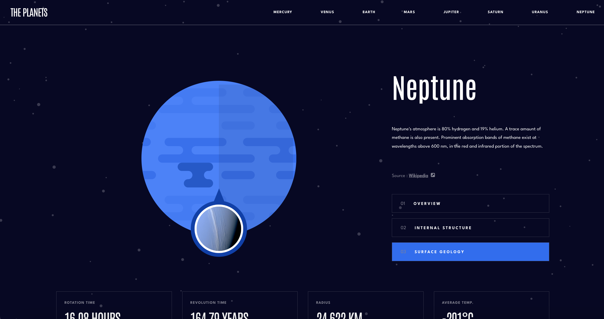

# Frontend Mentor - Planets fact site solution

This is a solution to the [Planets fact site challenge on Frontend Mentor](https://www.frontendmentor.io/challenges/planets-fact-site-gazqN8w_f). Frontend Mentor challenges help you improve your coding skills by building realistic projects.

## Table of contents

- [Overview](#overview)
  - [The challenge](#the-challenge)
  - [Screenshot](#screenshot)
  - [Links](#links)
- [My process](#my-process)
  - [Built with](#built-with)
  - [What I learned](#what-i-learned)
  - [Continued development](#continued-development)
  - [Useful resources](#useful-resources)
- [Author](#author)
- [Acknowledgments](#acknowledgments)

**Note: Delete this note and update the table of contents based on what sections you keep.**

## Overview

### The challenge

Users should be able to:

- View the optimal layout for the app depending on their device's screen size
- See hover states for all interactive elements on the page
- View each planet page and toggle between "Overview", "Internal Structure", and "Surface Geology"

### Screenshot

### Links

- Solution URL: [https://github.com/Kulya1986/fm_project7_planets_facts_site]
- Live Site URL: [https://planetsfactskulya1986.netlify.app/]

## My process

### Built with

- Semantic HTML5 markup
- Flexbox
- CSS Grid
- [React](https://reactjs.org/) - JS library
- [Sass] (https://sass-lang.com/) - a stylesheet language compiled to CSS

### What I learned

While working on this project I've leveraged my understanding of creating well-structured React projects. I've learned how to load and use custom fonts via @font-face rule instead of loading them from external servers. I've also sharpened up my skills in building responsive layouts with CSS grid and flexbox.

### Continued development

In next projects will aim to work on refining my skills in building mobile and responsive layouts. Also want to add more dynamics and interaction to the sites with React library solutions.

## Author

- Website - [Nataliia Kulyk](https://portfolio-page-sthy.onrender.com)
- Frontend Mentor - [@kulya1986](https://www.frontendmentor.io/profile/Kulya1986)
